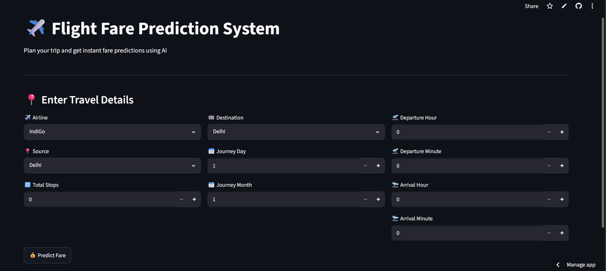

# ✈️ Flight Fare Prediction System

A Machine Learning web application that predicts flight ticket prices based on flight details.

## Live Demo

Add your Streamlit link here:

https://YOUR-APP.streamlit.app

---

## Features

- Predicts flight fares instantly
- Clean Streamlit interface
- Machine Learning model using Random Forest Regressor
- Responsive web application

---

## Technologies Used

- Python
- Streamlit
- Pandas
- Scikit-learn
- Joblib

---

## Input Features

- Airline
- Source
- Destination
- Total Stops
- Journey Day
- Journey Month
- Departure Hour
- Departure Minute
- Arrival Hour
- Arrival Minute

---

## Screenshots

### Home Page



### Prediction Result


---

## How to Run Locally

```bash
pip install -r requirements.txt
streamlit run app.py
```

---

## Project Structure

```
flight-fare-predictor/
│
├── app.py
├── flight_fare_model.pkl
├── requirements.txt
├── README.md
└── images/
```

---

## Author

Bobby
